# SQLite benchmarks for all popular ORM/Query Builders

Current repository is opened for any suggestions and modifications. Please create an issue if you find something wrong or not honest in queries. You can also create a PR with suggested fixes

We tried to get best queries from each library, but may have missed something. If you know how to improve any of queries we have - we are open to modify them

You can also add any other ORM you'd like to see here

You can also add any query you wan to benchmark

---

## Repository structure

1. `nw.sqlite` contains prepared data for benchmarks. All data was taken from `Northwind Traders database`

Current database has:

- `category` - 8 entities
- `customer` - 91 entities
- `employee` - 9 entities
- `order` - 16_818 entities
- `order_detail` - 621_883 entities
- `product` - 77 entities
- `region` - 4 entities
- `shipper` - 3 entities
- `supplier` - 29 entities
- `territory` - 53 entities

2. Current repository has separate folders for each library to run benchmarks

3. Main folder where all benchmarks were run against are in `common` folder. It has a set of groups divided by query that should be executed to get info from database

## How to run benchmarks

```bash
pnpm i && pnpm run start
```

After that you'll get terminal output with results. You can check sample output [here](./output.md)

## Benchmarks

Machine specs

```plain
RAM: 32GB
CPU: AMD Ryzen 9 7900X 12-Core Processor
Runtime: node v16.14.2 (x64-linux)
```

### Get all customers from database

#### Average queries per second

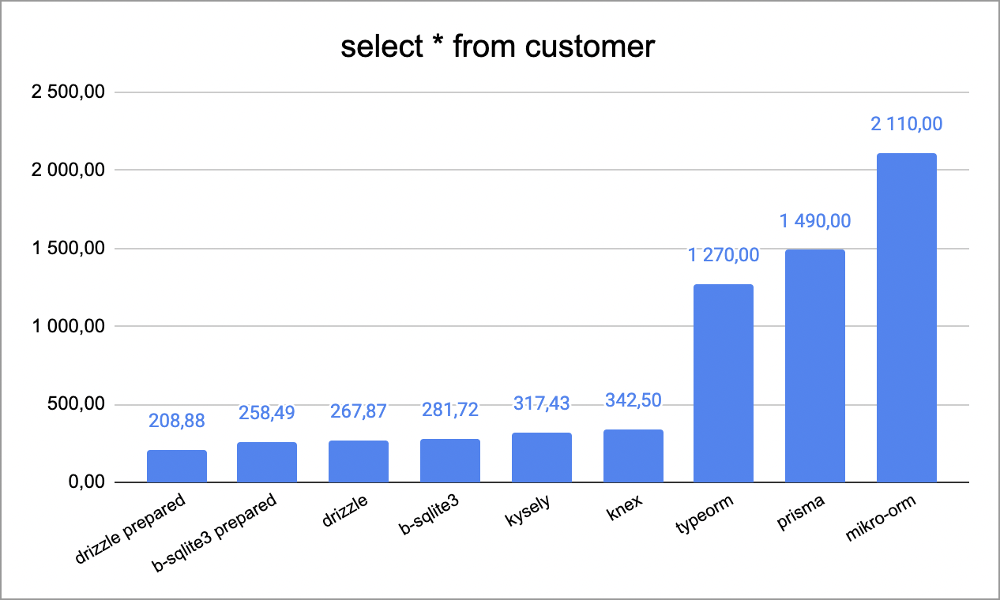

### Get a customer by specific ID

#### Average queries per second

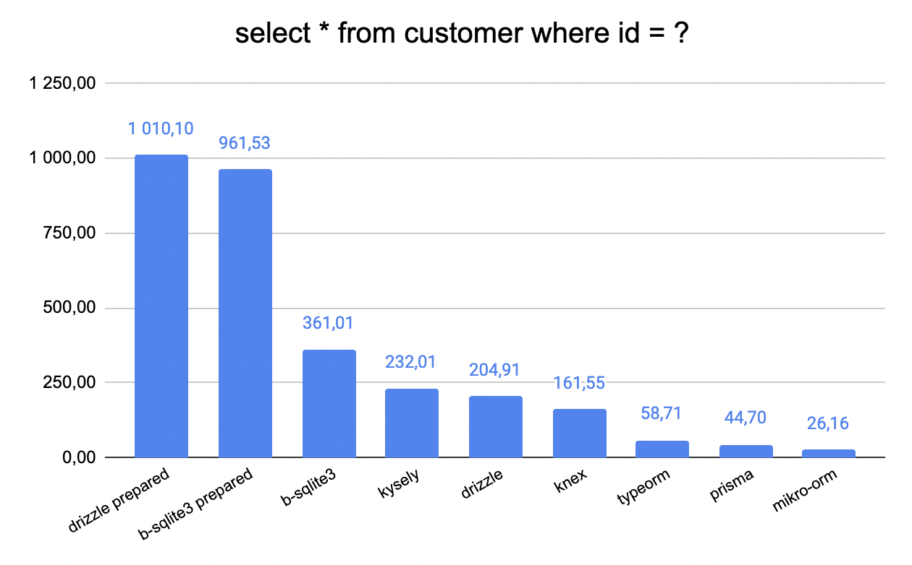

### Get all customers searching by company name

#### Average queries per second

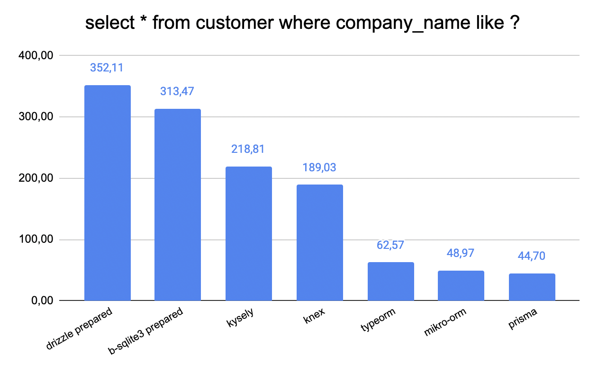

### Get all employee

#### Average queries per second

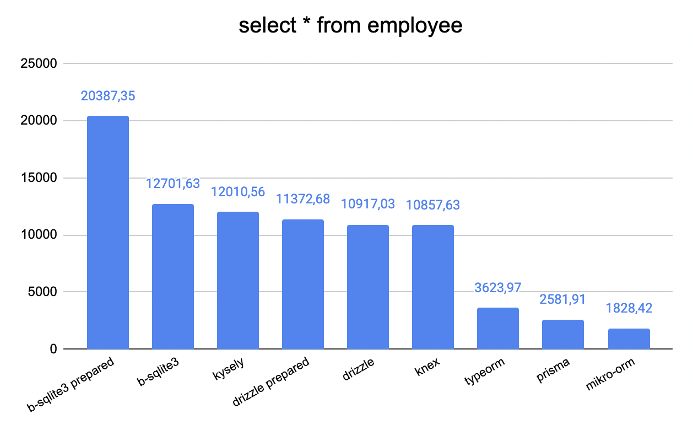

### Get employees by ID together with reportees

#### Average queries per second

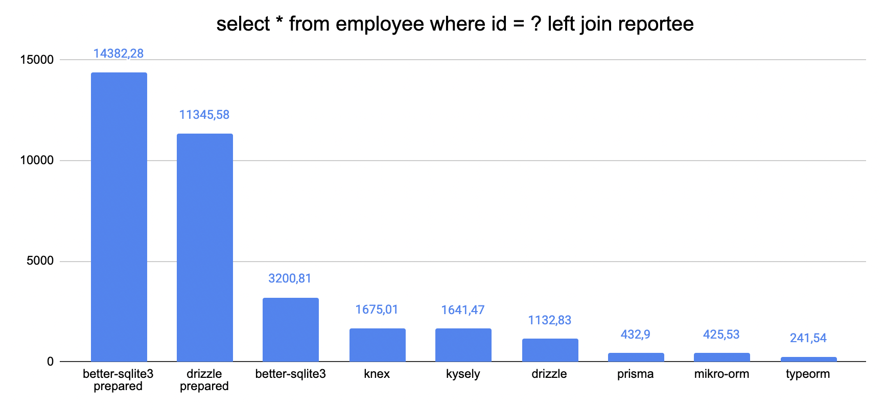

### Get all suppliers

#### Average queries per second

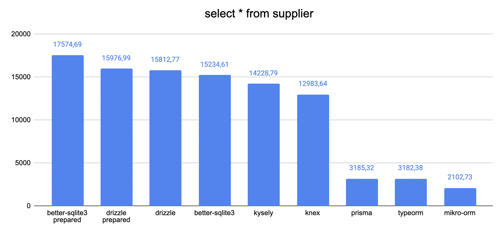

### Get a supplier by specific ID

#### Average queries per second

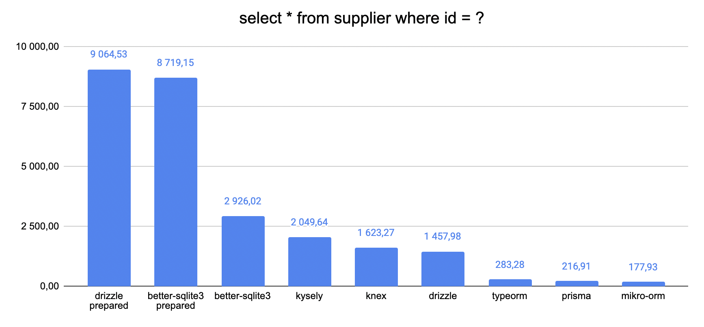

### Get all products

#### Average queries per second

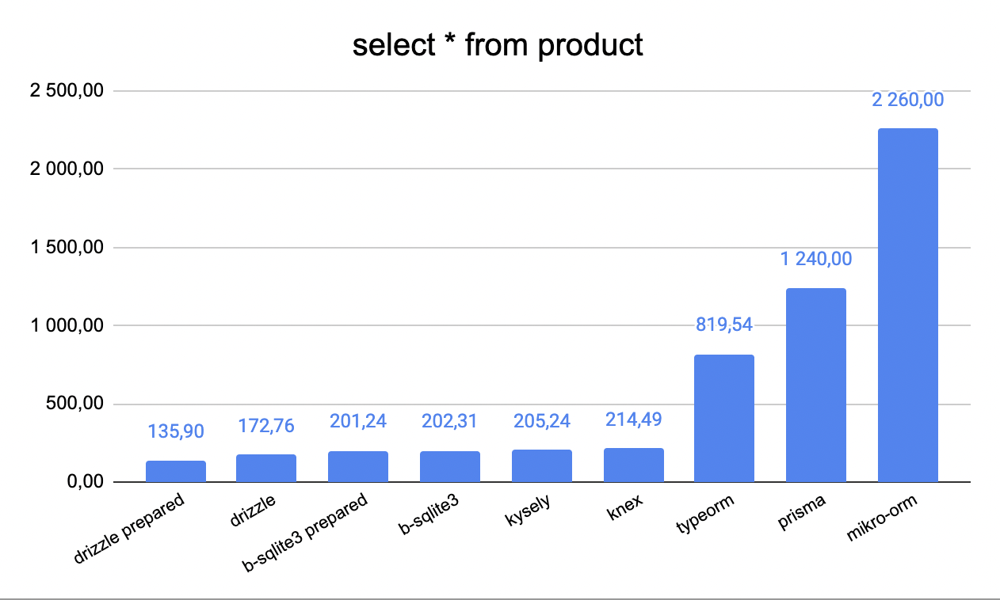

### Get a product by ID together with all suppliers

#### Average queries per second

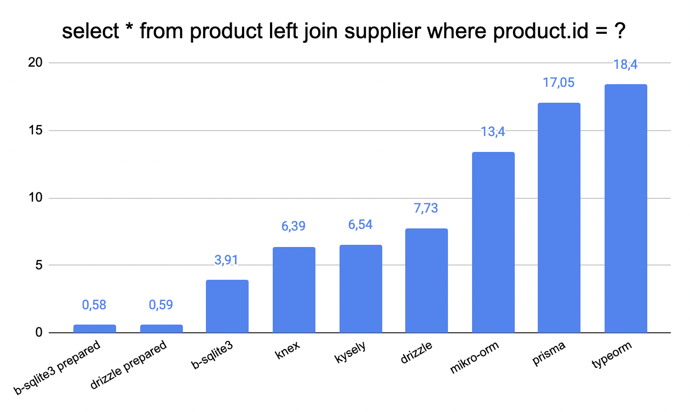

### Search for a product by name regex

#### Average queries per second

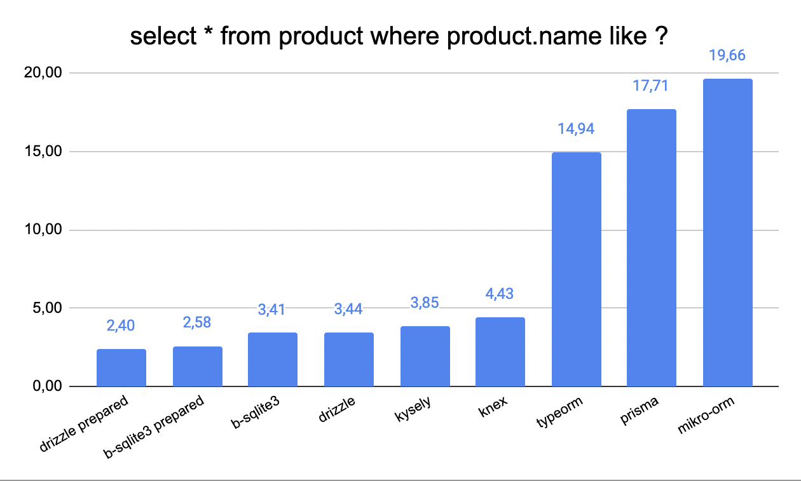

### Get all orders with amount of products in it and total price for each order

#### Average queries per second

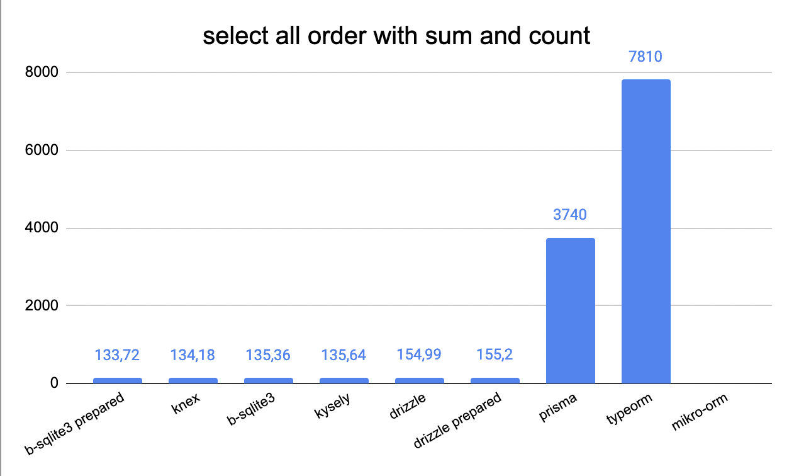

### Get all order details by specific order

#### Average queries per second

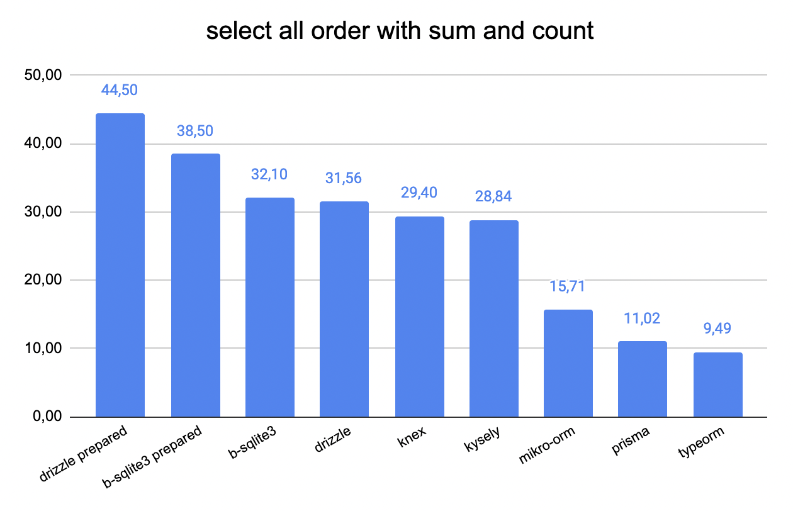
